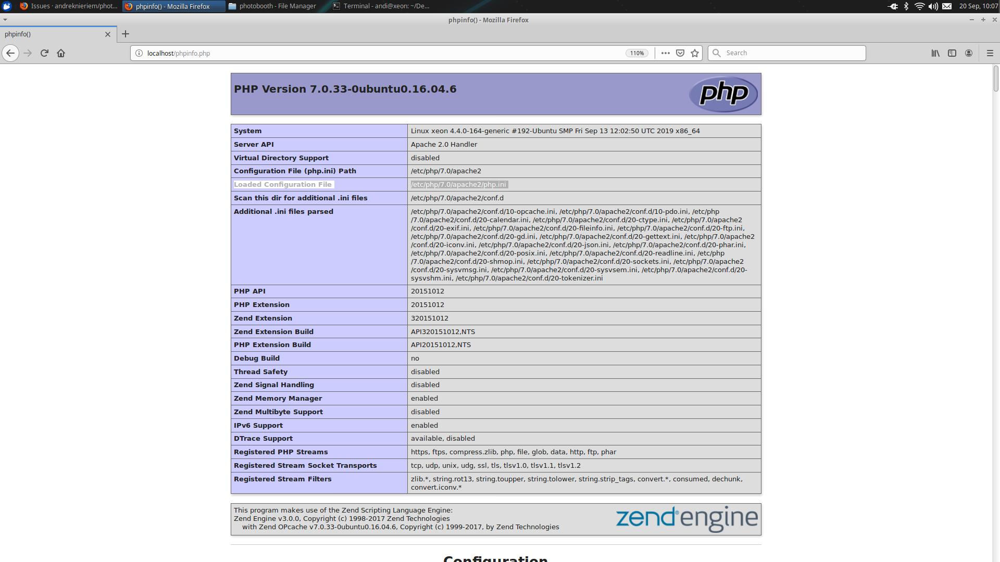

# FAQ - Frequently asked questions

### Is my Camera supported?

Some DSLR and Compact Cameras are not supported by this project. Please check for your specific model [here](http://gphoto.org/proj/libgphoto2/support.php).

---

### Is Pi Camera supported?

Yes it is.

Enable camera support using the `raspi-config` program you will have used when you first set up your Raspberry Pi.

```sh
sudo raspi-config
```

Use the cursor keys to select and open Interfacing Options, and then select Camera and follow the prompt to enable the camera.

Now you need to allow the webserver to use `raspistill` / `libcamera-still`. You need add the webserver user to video group and reboot once:

```sh
sudo gpasswd -a www-data video
reboot
```

Once done you need to adjust the configuration. Open the admin panel in your browser [localhost/admin](http://localhost/admin) and make the following changes:

**"Take picture command on Pi OS based on bullseye":**

`libcamera-still -n -o %s -q 100 -t 1 | echo Done`

**"Take picture command on Pi OS based on buster":**

`raspistill -n -o %s -q 100 -t 1 | echo Done`


Pi Camera works with these config change (also works together with preview at countdown if enabled).

Raspistill / libcamera-still does not give any feedback after the picture was taken, workaround for that with "echo".

(Thanks to Andreas Maier for that information)

You've the possibility to add more parameters if needed (define ISO, exposure, white balance etc.). Type `raspistill -?` / `libcamera-still -?`in your terminal to get information about possible parameters / settings.

---

### I've found a bug, how can I report?

Please take a look at the issue page [here](https://github.com/PhotoboothProject/photobooth/issues), if your bug isn't mentioned already you can create a new issue. Please give informations detailed as possible to reproduce and analyse the problem.

---

### I've a white page after updating to latest Source, how can I solve this?

On v1.9.0 and older:

It could be your local `config.json` file doesn't match latest source. This file is generated if you've used the admin panel to change your config.
Remove the file and try again!

```sh
sudo rm /var/www/html/admin/config.json
```

---

### How do I change the configuration?

Open `http://localhost/admin` in your Webbrowser and change the configuration for your personal needs.
Changed options are stored inside `config/my.config.inc.php` to prevent sharing personal data on Github by accident and to make an update of Photobooth easier.

---

### How to change the language?

Open `http://localhost/admin` in your Webbrowser and change the configuration for your personal needs.

---

### How to update or add translations?

#### On v2.3.0 and newer:

Photobooth joined Crowdin as localization manager, [join here](https://crowdin.com/project/photobooth) to translate Photobooth.

Crowdin gives a nice webinterface to make translating easy as possible. If there's different translations for a string, translator can use the vote function on suggested translations.

With Crowdin and your help translating we're able to get high-quality translations for all supported languages. Also it's easy to support a wider range of languages!

Your language is missing? Don't worry, create a [localization request here](https://github.com/PhotoboothProject/photobooth/issues/new/choose) and we'll add it to the project.

#### On v2.2.0 and older:

Edit the language file inside `resources/lang/` with your favorite text editor.

Once you're done upload your changes and create a [pull request](https://github.com/PhotoboothProject/photobooth/pulls).

---

### How can I test my current photo settings?

Open [http://localhost/test/photo.php](http://localhost/test/photo.php) in your Webbrowser and a you can find a photo that is created with your current settings.

---

### How can I test my current collage settings?

Open [http://localhost/test/collage.php](http://localhost/test/collage.php) in your Webbrowser and a you can find a collage that is created with your current settings.

---

### How can setup a custom collage design?

In the collage settings you can select the layout `private/collage.json`. This references a file with the given name in the photobooth's `private` folder. This file has to be created manually.

Content of the file is an array of arrays. The outer array defines the number of images, the inner array defines the horizontal position, vertical position, width, height and rotation (in that order) of one image.
For calculation of the values the variables x and y get converted to the width and height of the collage respectively, additionally math operations +, -, *, / and () can be used to calculate values.
The following example should look exactly like the 1+2 layout (this layout looks more complicated than it is due to the decimal places).
```
[
[ "0",                     "y * 0.055",           "1.5 * y * 0.55546",   "y * 0.55546",   "10"       ],
[ "x * 0.555",             "y * 0.055",           "1.5 * y * 0.40812",   "y * 0.40812",   "0"        ],
[ "x * 0.555",             "y * 0.5368",          "1.5 * y * 0.40812",   "y * 0.40812",   "0"        ]
]
```
```
[ "horizontal position",   "vertical position",   "width",               "height",        "rotation" ]
```
Please note that if the number of images in a collage design was changed the admin page has to be saved again to calculate the correct number of photos to be used for a collage.
Other value changes can be checked on the collage test page immediatly with a simple reload - so it's quite easy to configure a layout with the help of [http://localhost/test/collage.php](http://localhost/test/collage.php).
The file `collage.json` needs to be a well-formed json array and something like a missing quotation or a trailing comma can be enough to make a design fail.

---

### How to change the look of my Photobooth?

Photobooth can be easylie styled for your personal needs via admin panel, open [localhost/admin](http://localhost/admin) in your browser and take a look at the `User Interface` options.

To use a private custom index you need to create the following files:

- `resources/css/custom_style.css`
  - Optional: `src/sass/custom_style.scss` (`yarn build` will create the `resources/css/custom_style.css` out of it)
- `resources/css/custom_admin.css`
  - Optional: `src/sass/custom_admin.scss` (`yarn build` will create the `resources/css/custom_admin.css` out of it)
- `resources/css/custom_chromakeying.css`
  - Optional: `src/sass/custom_chromakeying.scss` (`yarn build` will create the `resources/css/custom_chromakeying.css` out of it)
- `resources/css/custom_live_chromakeying.css`
  - Optional: `src/sass/custom_live_chromakeying.scss` (`yarn build` will create the `resources/css/custom_live_chromakeying.css` out of it)
- `template/custom.template.php`

At least one of these custom style files need to exist! If other custom style files are missing a copy of the modern style file will be used.

Once you've created needed files you will be able to use the selection `custom` from the `"Styling"` option.

**Please note**: the custom style and template will not be tracked by git to avoid sharing by accident!

If you have e.g. private backgrounds (maybe files without a usable license) you can create a folder called `private` inside the root of your Photbooth source. This folder (and subfolders) will not be tracked by git to avoid sharing by accident!

---

### How to keep pictures on my Camera using gphoto2?

Add `--keep` (or `--keep-raw` to keep only the raw version on camera) option for gphoto2 via admin panel:

```sh
gphoto2 --capture-image-and-download --keep --filename=%s
```

On some cameras you also need to define the capturetarget because Internal RAM is used to store captured picture. To do this use `--set-config capturetarget=X` option for gphoto2 (replace "X" with the target of your choice):

```sh
gphoto2 --set-config capturetarget=1 --capture-image-and-download --keep --filename=%s
```

To know which capturetarget needs to be defined you need to run:

```sh
gphoto2 --get-config capturetarget
```

Example:

```
pi@raspberrypi:~ $ gphoto2 --get-config capturetarget
Label: Capture Target
Readonly: 0
Type: RADIO
Current: Internal RAM
Choice: 0 Internal RAM
Choice: 1 Memory card
```

---

### Cromakeying is saving without finishing saving

Checking the browser console you'll see a `413 Request Entity Too Large` error. To fix that you'll have to update your nginx.conf

Follow the steps mentioned here: [How to Fix NGINX 413 Request Entity Too Large Error](https://datanextsolutions.com/blog/how-to-fix-nginx-413-request-entity-too-large-error/)

---

### Can I use Hardware Button to take a Picture?

Yes, there's different ways!

#### Key code using connected HID devices

An HID device connected to your hardware can trigger different actions on your device. The HID device must be connected to the device you're accessing Photobooth from!

For example use <a href="https://keycode.info" target="_blank">https://keycode.info</a> to find out the key id of the button you like to use.

- Related configuration:

  **PICTURE section**:

  - Key code which triggers a picture: **define**

  **COLLAGE section**:

  - Key code which triggers a collage: **define**

  **PRINT section**:

  - Key code which triggers printing: **define**

#### Remotebuzzer Hardware Button feature using GPIO connected hardware (Raspberry Pi only)

**Important:** Works if you access Photobooth via [http://localhost](http://localhost) or [http://your-ip-adress](#), but accessing via the loopback IP (127.0.0.1) does not work!


The **Hardware Button** feature enables to control Photobooth through hardware buttons connected to Raspberry GPIO pins. This works for directly connected screens and as well for WLAN connected screen (i.e. iPad). Configuration takes place in the admin settings - Hardware Button section.

Using the Remotebuzzer feature makes the button action taking effect at the same time on all devices accessing Photobooth!

The Hardware Button functionality supports two separate modes of operation (select via admin panel):

- **Buttons**: Distinct hardware buttons can be connected to distinct GPIOs. Each button will trigger a separate functionality (i.e. take photo).
- **Rotary Encoder**: A rotary encoder connected to GPIOs will drive the input on the screen. This enables to use the rotary to scroll through the Photobooth UI buttons, and click to select actions. 

Both buttons and rotary encoder controls can be combined.

Photobooth will watch Button GPIOs for a PIN_DOWN event - so the hardware button needs to pull the GPIO to ground, for to trigger. This requires the GPIOs to be configured in PULLUP mode - always. 


##### Troubleshooting / Debugging

**Important: For WLAN connected screens you must make sure to set the IP address of the Photobooth web server in the admin settings - section "General"**. The loopback IP (127.0.0.1) does not work, it has to be the exact IP address of the Photobooth web server, to which the remote display connects to.

Having trouble?
- Set Photobooth loglevel to 1 (or above). (admin screen -> general section)
- Reload the Photobooth homepage
- Check the browser developer console for error logs
- Check the server logs for errors at the Debug panel: [http://localhost/admin/debugpanel.php](http://localhost/admin/debugpanel.php)
- If there is no errors logged but hardware buttons still do not trigger:
  - GPIO interrupts might be disabled. Check file `/boot/config.txt` and remove / disable the following overlay `dtoverlay=gpio-no-irq` to enable interrupts for GPIOs.
  - Button GPIOs may not be configured as PULLUP. The configuration for this is done in fie `/boot/config.txt` by adding the GPIO numbers in use as follows - you **must reboot** the Raspberry Pi in order to activate changes in this setting.
    ```
    gpio=16,17,20,21,22,23,26,27=pu
    ```
- For the shutdown and reboot buttons to work, `www-data` needs to have the necessary sudo permissions. This is done by the `install-photobooth.sh` script or can be manually added as
    ```sh
    cat >> /etc/sudoers.d/020_www-data-shutdown << EOF
    www-data ALL=(ALL) NOPASSWD: /sbin/shutdown
    EOF
    ```

As of Photobooth v3, hardware button support is fully integrated into Photobooth. Therefore the `button.py` script has been removed from the distribution. In case you are using this script and for continued backward compatibility please do not activate the Remote Buzzer Hardware Button feature in the admin GUI. Please note that continued backward compatibility is not guaranteed and in case of issues please switch to the integrated functionality.

##### Button Support

The server supports up to four connected hardware buttons for the following functionalities:

1) **Picture Button**

- Defaults to GPIO21
- Short button press (default <= 2 sec) will trigger a single picture in Photobooth
- Long button press (default > 2 sec) will trigger a collage in Photobooth

**Note:**

 -  If collage is configured with interruption, next button presses will trigger the next collage pictures. 
 -  If collage is disabled in the admin settings, long button press also triggers a single picture
 -  If the collage button is activated (see next), the picture button will never trigger a collage, regardless

2)  **Collage Button**

- Defaults to GPIO20
- Button press will trigger a collage in Photobooth.

**Note:**

- If collage is configured with interruption, next button presses will trigger the next collage pictures. 
- If collage is disabled in the admin settings (Collage section), this button will do nothing.

3) **Shutdown Button**

- Defaults to GPIO16
- This button will initate a safe system shutdown and halt (`shutdown -h now`).

**Note:**

- Hold the button for a defined time to initiate the shut down (defaults to 5 seconds). This can be adjusted in the admin settings.
- The shutdown button will only trigger if there is currently no action in progress in Photobooth (picture, collage). 

4) **Print Button**

- Defaults to GPIO26
- This button will initiate a print of the current picture either from the results screen or the gallery.

5) **Reboot Button**

- Defaults to GPIO23
- This button will initate a safe system shutdown and halt (`shutdown -r now`).


After any button is triggered, all hardware button remain disabled until the action (picture / collage) completed. Once completed, the hardware buttons re-arms / are active again.

The wiring layout is

```
Button            Raspberry

Picture     ---   GPIO 21
Collage     ---   GPIO 20
Shutdown    ---   GPIO 16
Print       ---   GPIO 26
Reboot      ---   GPIO 23
All         ---   GND
```

##### Rotary Encoder

A rotary encoder (i.e. [KY-040](https://sensorkit.en.joy-it.net/index.php?title=KY-040_Rotary_encoder)) is connected to the GPIOs. Turning the rotary left / right will navigate through the currently visible set of buttons on the screen. Button press on the rotary will activate the currently highlighted button in Photobooth.

The wiring layout is

```
Rotary
Encoder    Raspberry

CLK  ---   GPIO 27
DT   ---   GPIO 17
BTN  ---   GPIO 22
+    ---   3V3
GND  ---   GND
```

##### Known limitations:

- Delete Picture: in order to be able to access the Delete button through rotary control, please activate admin setting General -> "Delete images without confirm request"

The following elements are currently not supported and not accessible through rotary control navigation

- Full Screen Mode button: Looks like modern browser only allow to change to full screen mode upon user gesture. It seems not possible to change to full-screen using Javascript.
- Photoswipe download button: Not needed for Rotary Control. (well, if you can come up with a decent use-case, let us know).

#### Remote trigger using Socket.io (experimental)

The trigger server controls and coordinates sending commands via socket.io to the photobooth client. Next to a hardware button, any socket.io client can connect to the trigger server over the network, and send a trigger command. This gives full flexibility to integrate other backend systems for trigger signals.

- Channel:  `photobooth-socket`
- Commands: `start-picture`, `start-collage`, `collage-next`, `print`, `rotary-cw`, `rotary-ccw`, `rotary-btn-press`
- Response: `completed` will be emitted to the client, once photobooth finished the task


#### Remote trigger using simple web requests

*Note: This feature depends on the experimental Socket.io implementation and needs option `Hardware Button` - `Enable Hardware Buttons` to be active.*

Simple `GET` requests can be used to trigger single pictures or collages. Those endpoints can be found under `http://[Photobooth IP]:[Hardware Button Server Port]` where:
- `[Photobooth IP]` needs to match the configured value under `General` - `IP address of the Photobooth web server` and
- `[Hardware Button Server Port]` the value from `Hardware Button` - `Enable Hardware Buttons`

The available endpoints, depending on enabled features and hardware button options, are:
- `[Base Url]/` - Simple help page with all available endpoints
- `[Base Url]/commands/start-picture` - Triggers a single picture
- `[Base Url]/commands/start-collage` - Triggers a collage
- `[Base Url]/commands/start-print` - Triggers print
- `[Base Url]/commands/reboot-now` - Triggers reboot command
- `[Base Url]/commands/shutdown-now` - Triggers shutdown command
- `[Base Url]/commands/rotary-cw` - Focus next element
- `[Base Url]/commands/rotary-ccw` - Focus previous element
- `[Base Url]/commands/rotary-btn-press` - Triggers a click action

These trigger URLs can be used for example with [myStrom WiFi Buttons](https://mystrom.com/wifi-button/) or [Shelly Buttons](https://shelly.cloud/products/shelly-button-1-smart-home-automation-device/) (untested).


##### Installation steps for myStrom WiFi Button
- Be sure to connect the button to the same network as the photobooth
- The button can be configured using the following commands

    ```sh
    curl --location -g --request POST http://[Button IP]/api/v1/action/single --data-raw get://[Photobooth IP]:[Hardware Button Server Port]/commands/start-picture

    curl --location -g --request POST http://[Button IP]/api/v1/action/long --data-raw get://[Photobooth IP]:[Hardware Button Server Port]/commands/start-collage
    ```

---

### How do I enable Kiosk Mode to automatically start Photobooth in full screen?

Add the autostart file:

```sh
sudo nano /etc/xdg/autostart/photobooth.desktop
```

now add the following lines:

```
[Desktop Entry]
Version=1.3
Terminal=false
Type=Application
Name=Photobooth
Exec=chromium-browser --noerrdialogs --disable-infobars --disable-features=Translate --no-first-run --check-for-update-interval=31536000 --kiosk http://localhost --touch-events=enabled --use-gl=egl
Icon=/var/www/html/resources/img/favicon-96x96.png
StartupNotify=false
Terminal=false
```
save the file.

**NOTE:**

If you have installed Photobooth inside a subdirectory (e.g. to `/var/www/html/photobooth`), make sure you adjust the kiosk url (e.g. to `http://localhost/photobooth`) and the Icon path (e.g. to `/var/www/html/photobooth/resources/img/favicon-96x96.png`).

The flag `--use-gl=egl` might only be needed on a Raspberry Pi to avoid a white browser window on the first start of kiosk mode! If you're facing issues while using Photobooth on a different device, please remove that flag.

---

#### How to hide the mouse cursor, disable screen blanking and screen saver?

There are two options to hide the cursor. The first approach allows you to show the cursor for a short period of time (helpful if you use a mouse and just want to hide the cursor of some time of inactivity), or to hide it permanently.

##### Solution A
To hide the Mouse Cursor we'll use "unclutter":

```sh
sudo apt-get install unclutter
```

Edit the LXDE Autostart Script:

```sh
sudo nano /etc/xdg/lxsession/LXDE-pi/autostart
```

and add the following lines:

```
# Photobooth
# turn off display power management system
@xset -dpms
# turn off screen blanking
@xset s noblank
# turn off screen saver
@xset s off

# Hide mousecursor (3 describes the time after which the cursor should be hidden)
@unclutter -idle 3
# Photobooth End
```

##### Solution B
If you are using LightDM as display manager, you can edit `/etc/lightdm/lightdm.conf` to hide the cursor permanently. Just add `xserver-command=X -nocursor` to the end of the file.

---

### How to use a live stream as background at countdown?

There's different ways depending on your needs and personal setup:

#### Preview _"from device cam"_

If you access Photobooth on your Raspberry Pi you could use a Raspberry Pi Camera. Raspberry Pi Camera will be detected as "device cam".

- Admin panel config "Preview mode": `from device cam`

**Note:**

- Preview `"from device cam"` will always use the camera of the device where Photobooth get opened in a Browser (e.g. on a tablet it will always show the tablet camera while on a smartphone it will always show the smartphone camera instead)!
- Secure origin or exception required!
  - [Prefer Secure Origins For Powerful New Features](https://medium.com/@Carmichaelize/enabling-the-microphone-camera-in-chrome-for-local-unsecure-origins-9c90c3149339)
  - [Enabling the Microphone/Camera in Chrome for (Local) Unsecure Origins](https://www.chromium.org/Home/chromium-security/prefer-secure-origins-for-powerful-new-features)
- Admin panel config *"Device cam takes picture"* can be used to take a picture from this preview instead using gphoto / digicamcontrol / raspistill / libcamera-still.

#### Preview from DSLR

By now the DSLR handling of Photobooth on Linux was done exclusively using `gphoto2 CLI` (command line interface). When taking pictures while using preview video from the same camera one command has to be stopped and another one is run after that.

The computer terminates the connection to the camera just to reconnect immediately. Because of that there was an ugly video gap and the noises of the camera could be irritating as stopping the video sounded very similar to taking a picture. But most cameras can shoot quickly from live-view.

The underlying libery of `gphoto2 CLI` is `libgphoto` and it can be accessed using several programming languages. Because of this we can have a python script that handles both preview and taking pictures without terminating the connection to the camera in between.

**From Photobooth v4.1.0 a preview from DSLR depends on the _"Preview from device cam"_ config**

To use `gphoto-python`, first execute the `install-gphoto-python.sh` if you have not already installed "a service to set up a virtual webcam that gphoto2 can stream video to" while using the Photobooth installer on initial installation:

```sh
wget https://raw.githubusercontent.com/PhotoboothProject/photobooth/dev/gphoto/install-gphoto-python.sh
sudo bash install-gphoto-python.sh
```

Change your Photobooth configuration:

- _"Live Preview_": _"Preview Mode"_: _"from device cam"_
- _"Commands_": _"Execute start command for preview on take picture/collage"_:
  - if **enabled**:
    _"Commands"_: _"Command to generate a live preview"_: `python3 cameracontrol.py --bsm`
  - if **disabled**:
    _"Commands"_: _"Command to generate a live preview"_: `python3 cameracontrol.py`
- _"Commands"_: _"Take picture command"_: `python3 cameracontrol.py --capture-image-and-download %s`


**Further information**:

The _"Command to generate a live preview"_ is only executed if the _"Preview Mode"_ is set to _"from device cam"_.
 
There's no need to define the _"Command to kill live preview"_ while using the _cameracontrol.py_, so just empty that field. The _"Command to kill live preview"_ is only executed if defined.

If you want to use the DSLR view as background video, enable _"Use stream for live preview as background"_ and disable the _"Execute start command for preview on take picture/collage"_ setting of Photobooth, which is enabled by default.


If you don't want to use the DSLR view as background video enable the _Execute start command for preview on take picture/collage_ setting of Photobooth and make sure `--bsm` was added to the preview command.

```sh
python3 cameracontrol.py --bsm
```
If _Execute start command for preview on take picture/collage_ is enabled, the preview video is activated when the countdown for a photo starts and after taking a picture the video is deactivated while waiting for the next photo.


As you possibly noticed the params of the script are designed to be similar to the ones of `gphoto2 CLI` but with some shortcuts like `-c` for `--capture-image-and-download`. If you want to know more check out the help of the script by running:

```sh
python3 /var/www/html/api/cameracontrol.py --help
```

or on subfolder installation of Photobooth

```sh
python3 /var/www/html/photobooth/api/cameracontrol.py --help
```

If you want to keep your images on the camera you need to use the same `capturetarget` config as when you were using `gphoto CLI` (see "How to keep pictures on my Camera using gphoto2?"). Set the config on the preview command like this:

```sh
python3 cameracontrol.py --set-config capturetarget=1
```


If you get errors from Photobooth and want to get more information try to run the preview command manually. The script is in Photobooth's `api` folder. To do so end all running services that potentially try to access the camera with `killall gphoto2` and `killall python3` (if you added any other python scripts manually you might have to be a bit more selective than this command).

Finally if you just run `venv/bin/python3 cameracontrol.py --capture-image-and-download %s` as take picture command without having a preview started it only takes a picture without starting any kind of preview and ends the script immediately after the picture.

In theory `cameracontrol.py` might be able to completely replace `gphoto2 CLI` for all DSLR connection handling in the future.


**Note**

- Liveview **must** be supported for your camera model, [check here](http://gphoto.org/proj/libgphoto2/support.php)
- Give permissions to /dev/video*: `sudo gpasswd -a www-data video` (this was done automatically if you used the installation script) and reboot once.
- Requires Photobooth v4.1.0 or later! (Instructions for older versions have been removed from the FAQ, but an FAQ with instructions matching your installed Photobooth version can always be found at [http://localhost/faq](http://localhost/faq)).
- You need to access Photobooth directly via [http://localhost](http://localhost), you won't be able to see the preview on a different device (e.g. Tablet).
- There's a delay of about 3 seconds until the preview starts, to avoid that disable the `Execute start command for preview on take picture/collage` option to generate a preview in background. **This results in a high battery usage and also a general slowdown.**
- Chromium sometimes has trouble, if there is another webcam like `bcm2835-isp`, it will take it by default instead. Disable other webcams, e.g. `sudo rmmod bcm2835-isp`.
- Make sure the countdown is long enough to start the preview, for best user experience the countdown should be set at least to 8 seconds.

**Troubleshooting**

In some cases, the v4l2loopback doesn't seem to be working after an update and breaking the preview from DSLR.

Run `v4l2-ctl --list-devices` from your terminal to see if everything is fine.

If it works you get the following output:

```
GPhoto2 Webcam (platform:v4l2loopback-000):
        /dev/video0
```

If it doesn't work:

```
Cannot open device /dev/video0, exiting
```

If it doesn't work, you might need to compile the v4l2loopback Module yourself by running the following commands:

```sh
curl -LO https://github.com/umlaeute/v4l2loopback/archive/refs/tags/v0.12.7.tar.gz
tar xzf v0.12.7.tar.gz && cd v4l2loopback-0.12.7
make && sudo make install
sudo depmod -a
sudo modprobe v4l2loopback exclusive_caps=1 card_label="GPhoto2 Webcam"
```

Now again check if everything is fine (`v4l2-ctl --list-devices`).

If you're still having trouble feel free to join us at Telegram to get further support.


#### Preview _"from URL"_

If you like to have the same preview independent of the device you access Photobooth from:

Make sure to have a stream available you can use (e.g. from your Webcam, Smartphone Camera or Raspberry Pi Camera)

- Admin panel config *"Preview mode"*: `from URL`
- Admin panel config *"Preview-URL"* example (add needed IP address instead): `url(http://192.168.0.2:8081)`

**Note**

- Do NOT enable *"Device cam takes picture"* in admin panel config!
- Capture pictures via `raspistill` or `libcamera-still` won't work if motion is installed!
- Requires Photobooth v2.2.1 or later!

---

### Can I use a live stream as background?

Yes you can. There's different ways depending on your needs and personal setup:

1. On Photobooth v2.4.0 and newer you can use the option "Use stream from device cam as background" inside admin panel.
    - If enabled, a stream from your device cam is used as background on start screen. It's still possible to use preview from your device cam as background on countdown and also still possible to take pictures via device cam or using `raspistill` / `libcamera-still` for Pi Camera.

2. You need to change the background URL path via config or admin panel. Replace `url(../img/bg.jpg)` with your IP-Adress and port (if needed) as URL.
    Example:

    ```sh
    -   url(../img/bg.jpg)
    +   url(http://192.168.0.2:8081)
    ```

    To use a Raspberry Pi Camera module Motion is required, but you won't be able to use the Raspberry Pi Camera 
    for preview at countdown!

    ```sh
    sudo apt-get install -y motion
    ```

    _/etc/motion/motion.conf_ needs to be changed to your needs (e.g. starting on boot, using videoX, resolution, etc.).

    If you're accessing Photobooth from an external device (e.g. Tablet or Mobile Phone) replace `127.0.0.1` with your IP-Adress.

    For reference:
    [https://github.com/andreknieriem/photobooth/pull/20](https://github.com/andreknieriem/photobooth/pull/20)

---

### I've trouble setting up E-Mail config. How do I solve my problem?

If connection fails some help can be found [here](https://github.com/PHPMailer/PHPMailer/wiki/Troubleshooting), especially gmail needs some special config.

- Should be obvious but the photobooth must be connected to WIFI/internet to send photos live.

  Otherwise, tell them to check the box to send them the photo later and it will add everyone's email to a list for you.

- For gmail you need to generate an app password if you have 2-factor authentication on.

Tested working setup:

- gmail.com
  - Email host adress: `smtp.gmail.com`
  - Username: `*****@gmail.com`
  - Port: `587`
  - Security: `TLS`

- gmx.de
  - Email host adress: `mail.gmx.net`
  - Username: `*****@gmx.de`
  - Port: `587`
  - Security: `TLS`

- web.de
  - Email host adress: `smtp.web.de`
  - Username: `*****` (@web.de is not needed in your username)
  - Port: `587`
  - Security: `TLS`

---

### How to only open the gallery to avoid people taking pictures?

Open [http://localhost/gallery.php](http://localhost/gallery.php) in your browser (you can replace `localhost` with your IP adress).

---

### Chromakeying isn't working if I access the Photobooth page on my Raspberry Pi, but it works if I access Photobooth from an external device (e.g. mobile phone or tablet). How can I solve the problem?

Open `chrome://flags` in your browser.

Look for *"Accelerated 2D canvas"* and change it to `"disabled"`.

Now restart your Chromium browser.

---

### How to adjust the ```php.ini``` file?

Open [http://localhost/phpinfo.php](http://localhost/phpinfo.php) in your browser.

Take a look for "Loaded Configuration File", you need _sudo_ rights to edit the file.

Page will look like this:

<details><summary>CLICK ME</summary>

</details>

---

### Turn Photobooth into a WIFI hotspot

If you would like to allow your guests to download their images without connecting to your private WIFI or when there is no other WIFI around, you can turn your Raspberry Pi into setup an access point and WiFi client/station network on the single WiFi chip of the Raspberry Pi.

The default setting is to call your wifi hotspot *Photobooth* as this is built into the Photobooth prompt for guests to download images via QR code.

First, make sure `iptables` package is installed:

```sh
sudo apt-get install iptables
```

Now download and run the rpihotspot installer:

```sh
wget https://raw.githubusercontent.com/idev1/rpihotspot/master/setup-network.sh
chmod +x setup-network.sh
sudo ./setup-network.sh --install-upgrade --ap-ssid="Photobooth" --ap-password="password" --ap-password-encrypt
--ap-country-code="CA" --ap-ip-address="10.10.10.10" --wifi-interface="wlan0"
```

There are a couple of flags you need to change from the example command below:

 - change `password` to your desired password, make it easy enough for guests to remember.
 - change `country code` from `CA` to your own localization.
 - keep or change the ip address `10.10.10.10`. Remember what you change it to.


If you run into any errors setting up your hotspot we can remove all the settings and try it again. The first time I ran this I ran into an error, I reset it using the command below, then reinstalled it. It went smoothly the second time:

```sh
sudo bash setup-network.sh --clean
```

---

### Automatic picture syncing to USB stick

This feature will automatically and in regular intervals copy (sync) new pictures to a plugged-in USB stick. Currently works on Raspberry PI OS only.

Use the `install-photobooth.sh` script to get the operating system setup in place.

**Note:** If you have declined the question to enable the USB sync file backup while running the `install-photobooth.sh` you need to run the following commands to get the operating system setup done:

```sh
wget https://raw.githubusercontent.com/PhotoboothProject/photobooth/dev/enable-usb-sync.sh
sudo bash enable-usb-sync.sh -username='<YourUsername>'
```

The target USB device is selected through the admin panel.

A USB drive / stick can be identified either by the USB stick label (e.g. `photobooth`), the operating system specific USB device name (e.g. `/dev/sda1`) or the USB device system subsystem name (e.g. `sda`). The preferred method would be the USB stick label (for use of a single USB stick) or the very specific USB device name, for different USB stick use. The default config will look for a drive with the label photobooth. The script only supports one single USB stick connected at a time

Pictures will be synced to the USB stick matched by the pattern, as long as it is mounted (aka USB stick is plugged in)

Debugging: Check the server logs for errors at the Debug panel: [http://localhost/admin/debugpanel.php](http://localhost/admin/debugpanel.php)

---

### Raspberry Touchpanel DSI simultaneously with HDMI

When using a touchscreen on DSI and an HDMI screen simultaneously, the touch input is offset. This is because both monitors are recognized as one screen.

The remedy is the following:

```
xinput list
```

remember the device id=[X] of the touchscreen.

```
xinput list-props "Device Name" 
```

Get the ID in brackets (Y) of Coordinate Transformation Matrix

```
xinput set-prop [X] --type=float [Y] c0 0 c1 0 c2 c3 0 0 1
```

adjust the coding c0 0 c1 0 c2 c3 0 0 1 with your own data.

You can get the values of your screens with the following command:

```
xrandr | grep \* # xrandr uses "*" 
```

to identify the screen being used

```
c0 = touch_area_width / total_width
(width of touch screen divided by width of both screens)
c2 = touch_area_height / total_height
(height touch screen divided by height of both screens)
c1 = touch_area_x_offset / total_width
c3 = touch_area_y_offset / total_height
```

and execute the above command again with your own coding!

Example:

```
xinput set-prop 6 --type=float 136 0.3478260869565217 0 0 0.55555555555556 0 0 0 1
```

Now unfortunately the settings are only valid for the current session. So create the following desktop startup file with your own values:

```sh
nano ~/.config/autostart/touch.desktop
```

Example:

```
[Desktop Entry]
Name=TouchSettingsAutostart
Comment=Set up touch screen setting when starting desktop
Type=Application
## Adapt command to own values
Exec=xinput set-prop 6 --type=float 136 0.3478260869565217 0 0 0 0.55555555555556 0 0 0 1
Terminal=false
```

If you want to use the touchscreen as photobooth and the second monitor for the standalone slideshow for example, open the autostart file:

```sh
sudo nano /etc/xdg/lxsession/LXDE-pi/autostart
```

and enter/adjust the @chromium-browser entries as followed (adjust the value _1920_ to your own resolution and URL if necessary):

```
@chromium-browser --new-window --start-fullscreen --kiosk http://localhost --window-position=1920,0 --user-data-dir=Default
@chromium-browser --new-window --start-fullscreen --kiosk http://localhost/slideshow/ --window-position=0,0 --user-data-dir='Profile 1'
```

---

### How to administer CUPS remotely using the web interface?

By default the CUPS webinterface can only be accessed via [http://localhost:631](http://localhost:631) from your local machine.

To remote access CUPS from other clients you need to run the following commands:

```sh
sudo cupsctl --remote-any
sudo /etc/init.d/cups restart
```

### I get the error message "Something went wrong." while taking a picure, what can i do?

There's different reasons if you get the error "Something went wrong. Please try it again. Photobooth reloads automatically." while taking an image.

First of all, please set the **Loglevel** to **2** via admin panel (GENERAL section, [http://localhost/admin](http://localhost/admin)) and try again. You'll still see the error message, but we make sure to log enough information to see what's wrong.

Now open the Debug panel ([http://localhost/admin/debugpanel.php](http://localhost/admin/debugpanel.php)) and check the Photobooth log for error messages. You should see something like this:

```
2023-01-03T08:34:37+01:00:
Array
(
    [error] => Take picture command returned an error code
    [cmd] => gphoto2 --capture-image-and-download --filename=/var/www/html/data/tmp/20230103_083437.jpg 2>&1
    [returnValue] => 1
    [output] => Array
        (
            [0] =>
            [1] => *** Error ***
            [2] => Could not detect any camera
            [3] => *** Error (-105: 'Unknown model') ***
            [4] =>
            [5] => For debugging messages, please use the --debug option.
            [6] => Debugging messages may help finding a solution to your problem.
            [7] => If you intend to send any error or debug messages to the gphoto
            [8] => developer mailing list , please run
            [9] => gphoto2 as follows:
            [10] =>
            [11] =>     env LANG=C gphoto2 --debug --debug-logfile=my-logfile.txt --capture-image-and-download --filename=/var/www/html/testa/data/tmp/20230103_083437.jpg
            [12] =>
            [13] => Please make sure there is sufficient quoting around the arguments.
            [14] => 
        )

    [php] => takePic.php
)
```

Most of the time the error messages are self explained (in our case no camera was detected, the cable wasn't plugged in), if you're still having trouble you can check the following information about possible known problems.


#### GPhoto2 troubleshooting

Please note, that GPhoto2 is an own software we can use to take images via Photobooth. The full documentation can be found at [http://www.gphoto.org/doc/](http://www.gphoto.org/doc/).

**Here are some general known problems you should know about:**

Make sure "Image capture" is supported by GPhoto2 for your camera ([http://gphoto.org/proj/libgphoto2/support.php](http://gphoto.org/proj/libgphoto2/support.php))

Try another camera mode.
- Sometimes not every camera mode is supported by GPhoto2.

Make sure your camera is set to "JPEG/JPG only", Photobooth isn't able to use RAW images.
- Reducing the image quality on your camera can have a positive effect to the performance - especially on low end hardware like a Raspberry Pi.

Disable the auto-focus.
- GPhoto2 won't be able to take a picture if your camera can't find a focus.

Turn off the WiFi of your camera (if available).
- There might be issues on the connection if WiFi is turned on on your camera.

Make sure a SD-Card is inserted into the camera.
- GPhoto2 sometimes has trouble to trigger an image if no SD-Card is inserted.

Make sure pictures aren't taken into the RAM of the camera.
- Sometimes we need to define the Capturetarget to the memory card manually. To find out the right capturetarget type the following into your terminal and press enter:

```
gphoto2 --get-config capturetarget
```

  Your output will look like this:

```
pi@raspberrypi:~ $ gphoto2 --get-config capturetarget
Label: Capture Target
Readonly: 0
Type: RADIO
Current: Internal RAM
Choice: 0 Internal RAM
Choice: 1 Memory card   <--- !!!
```

  Adjust your take picture command via adminpanel accordingly:

```
gphoto2 --set-config capturetarget=1 --capture-image-and-download --filename=%s
```


#### Hardware issues

Enough power on the USB port?

Defect USB cable?


#### Permission problem

It's easy to check if there's an issue with the permissions. The Photobooth installer takes care about needed permissions and shouldn't be a thing.

Sometimes permission can be wrong after an update.

Open your terminal and try to take an image:

```
gphoto2 --capture-image-and-download --filename=test.jpg
```

Everything works?

- **No**: Please again read previous information.
- **Yes**: let's test further!

Now try to take an image as "www-data" User:

```
cd /var/www/html
sudo -u www-data -s
gphoto2 --capture-image-and-download --filename=test.jpg
```

Everything working?

- **Yes**: Check your Photobooth configuration for issues. Maybe reset the config to restore the default settings.
- **No**: It looks like there's an issue with the permissions! But we can fix that!

Set the ownership for Photobooth to the "www-data" User:

```
sudo chown -R www-data:www-data /var/www/
```

Also make sure the "www-data" User is able to access the USB device (reboot required!):
```
sudo gpasswd -a www-data plugdev
reboot
```

Everything working?

- **No**: The camera might be claimed by a different process. The gvfs-gphoto2-volume-monitor is known to cause trouble and shouldn't be executed.  
  The Photobooth installer should take care about it, but maybe something went wrong and we should change it manually (reboot required!):

```
sudo chmod -x /usr/lib/gvfs/gvfs-gphoto2-volume-monitor
reboot
```

Does it work?

- **No**: Try updating gphoto2 and libgphoto. Run the following commands to install latest development version of gphoto2 and libgphoto:

```
wget https://raw.githubusercontent.com/gonzalo/gphoto2-updater/master/gphoto2-updater.sh
wget https://raw.githubusercontent.com/gonzalo/gphoto2-updater/master/.env
chmod +x gphoto2-updater.sh
sudo ./gphoto2-updater.sh --development
sudo chmod -x /usr/lib/gvfs/gvfs-gphoto2-volume-monitor
reboot
```

Now try again! Does it work?

- **No**: Sorry, we're am almost out of ideas! Please check the special notes below and feel free to contact us at [Telegram](https://t.me/PhotoboothGroup) if you still have issues.


#### Special notes

##### Canon EOS 1300D

To capture an image gphoto2 might need some time. Add `–wait-event=300ms` to the take picture CMD. Your take picture CMD should look like this:

```
gphoto2 –wait-event=300ms –capture-image-and-download –filename=%s
```

Source: [https://www.dennis-henss.de/2020/01/25/raspberry-pi-fotobox-fuer-hochzeiten-und-geburtstage/#comment-1211](https://www.dennis-henss.de/2020/01/25/raspberry-pi-fotobox-fuer-hochzeiten-und-geburtstage/#comment-1211)

### How to upload pictures to a remote server after picture has been taken?

#### Goal: 
After a picture is taken with the photobox upload it automatically to a remote server.

#### Usecase: 
You have a remote server (e.g. with your website on it) or another Raspberry Pi to which you’d like instantly synchronizing your taken pictures. Also you could upload the pictures to a remote server and make them available through the QR code over the internet. By this you would not require people to access a local Wifi to download the picture from your local device which is running your Photobox. 

#### How to:
-	You should have a remote server with an SSH login. Know your username and password: (e.g.: [username.strato-hosting.eu]@ssh.strato.de)
-	We will be using the Post-photo script / command of the Photobox which you can find in the admin panel in the section Commands. 
-	The command is being executed after the picture has been taken and gets the picture’s name as an attribute.
-	Command: 	
```sh
scp /var/www/html/photobooth/data/images/%s [username@remotehost]:/[path_to_where_you_want_to_store_the_pictures_on_the_remote_host]
```

-	If we keep it like that the remote server would require the source server to type in a password each time a picture is being copied to the remote server. An SSH connection using a private/public SSH key needs to be established:

1. Create a public/private key-pair for the www-data user on the source machine (why for that user? The www-data user is executing the Post-photo script/command in the background) – Do not enter a passphrase when prompted.
```sh
sudo -u www-data ssh-keygen -t rsa
```
2. Copy the public key to the remote (destination) server 
```sh
sudo -u www-data ssh-copy-id [username@remotehost]
```
3. You can now manually test whether the connection works. Try to copy anything to the remote server and change the file in the below example to a file that you actually have on your source machine. You shouldn’t be prompted with a password, but the copy and transfer should complete successfully just with the following command. If that is going to be successful, copying your pictures automatically should work now.
```sh
sudo -u www-data scp /var/www/html/photobooth/data/images/20230129_125148.jpg [username@remotehost]:/[path_to_where_you_want_to_store_the_pictures]
```
You can now use the URL with which you can access your remote server from the internet and paste it into the QR code field in the Photobox admin panel. Now using the QR code your pictures can be downloaded from your remote server. 
